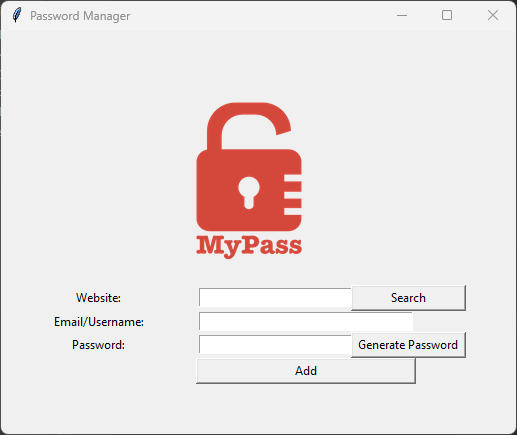

# Password Manager v-1.1

This is a simple password manager application built with Python and Tkinter. It allows you to store website, email, and password information securely.

## Features

- Generate strong passwords: The application provides a password generator that creates random and secure passwords for your accounts.
- Store passwords: You can enter the website, email/username, and password details and save them securely for future reference
- Input validation: The application ensures that no field is left empty before saving the password details. It displays an error message
- if any field is missing.
- User-friendly graphical interface
- Data saved in a text file
- Store password locally on your computer
-- UPDATE
- Clear functionality: You can easily clear the website and password fields with the click of a button.

## Code Explanation

- The code uses the `random` and `tkinter` modules.
- The `generate_password` function generates a random password and updates the password entry field.
- The `save` function saves the entered information to a text file.
- The GUI is created using Tkinter widgets.
- The application allows users to enter website, email, and password information and store it securely.
- It provides an option to generate strong passwords and saves the data for future reference.

## Prerequisites
To run the Password Manager application, you need to have the following:

- Python 3.x installed on your machine
- Tkinter library (usually included with Python installations)

## How to Use

1. Clone the repository to your local machine.
2. Run the `password_manager.py` file using Python.
3. Enter the website, email, and password information in the respective fields.
4. Click the "Generate Password" button to generate a random password.
5. Click the "Add" button to save the entered information.
6. The data will be saved in the `data.txt` file in the same directory.

Feel free to modify and enhance the application to suit your needs.

## How to Run

1. Clone the repository to your local machine or download the source code as a ZIP file.
2. Open a terminal or command prompt and navigate to the project directory.
3. Run the following command to start the Password Manager application: `python password_manager.py`
4. The Password Manager window will open, allowing you to generate passwords, enter and save password details, and manage your passwords easily.

## Acknowledgements

The Password Manager application is based on the tutorial from [Dr. Angela Yu's Python Course](https://www.udemy.com/course/100-days-of-code/).

Feel free to customize and enhance the application to suit your needs. Happy password management!

